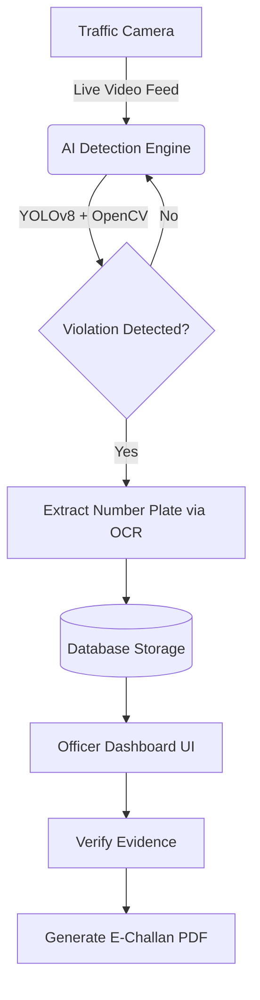
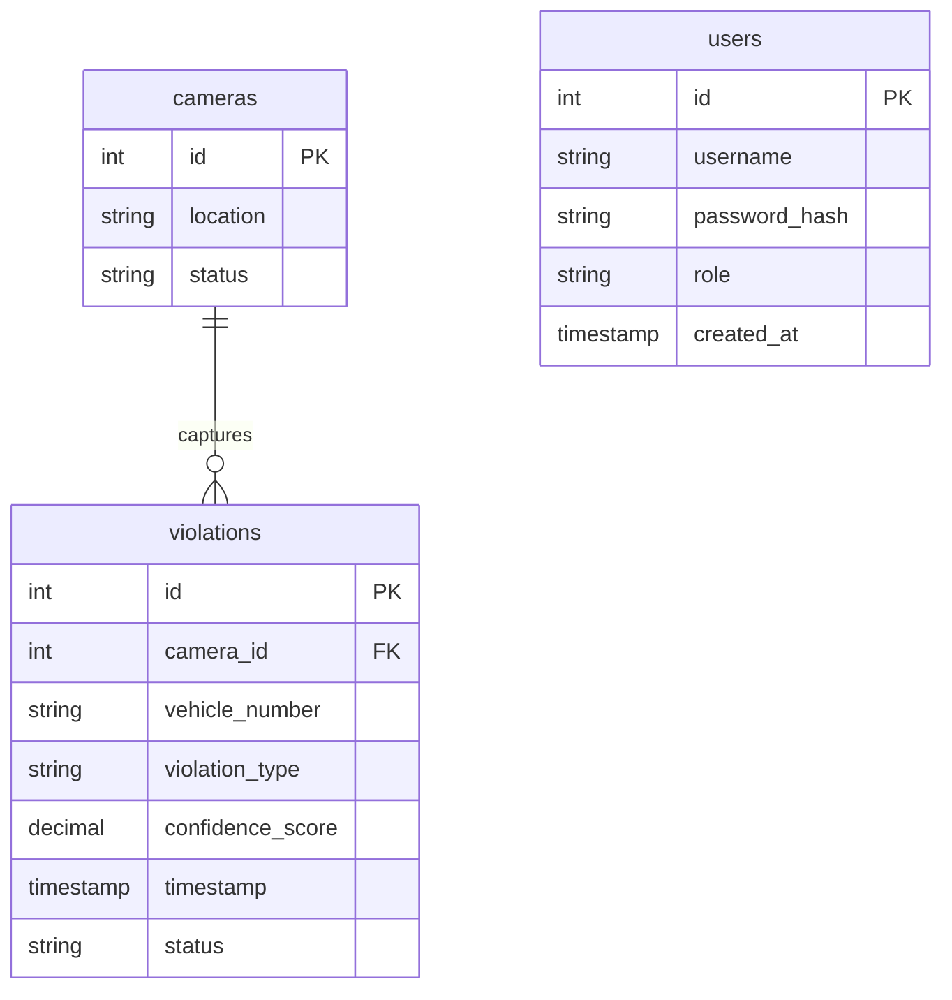

# AI Traffic Cop Pro: AI-Powered Traffic Violation Detection

## Overview
AI Traffic Cop Pro is an intelligent, web-based platform designed to monitor live traffic camera feeds. It leverages computer vision to automatically detect traffic violations—such as missing helmets, absent seatbelts, and overspeeding—and streamlines the e-challan generation process for traffic authorities.

## Problem Statement
Traditional traffic monitoring relies heavily on manual surveillance, leading to delayed enforcement, human error, and inefficiencies in high-traffic zones. This project aims to provide an automated, highly accurate monitoring dashboard that generates real-time alerts and digital evidence to improve road safety.

## Features
* Secure Role-Based Authentication (Admin & Traffic Officer)
* Live Multi-Camera Monitoring Interface
* Automated Helmet & Seatbelt Violation Detection
* OCR-Based Number Plate Recognition
* Real-Time Violation Alerts
* Searchable Offense History & Evidence Logs
* One-Click E-Challan PDF Generation

## System Workflow

## Basic Modules

The application is structured into the following core modules:

1. **User Authentication Module:**
* Handles secure login and role-based access for traffic officers and system administrators.

2. **Video Capture & AI Processing Module:**
* Interfaces with live traffic feeds, processing frames using YOLOv8 for object detection and EasyOCR for number plate extraction.

3. **Violation Management Module:**
* Logs detected offenses, captures cropped evidence images, and calculates confidence scores.

4. **Real-Time Dashboard Module:**
* An interactive frontend that displays live metrics, recent violations, and high-risk traffic zones.

5. **E-Challan Generation Module:**
* Compiles the captured evidence, vehicle details, location, and timestamp into an official PDF report.

## Database Design

### Table List

The database consists of the following key tables:

| Table Name | Description | Key Fields |
| --- | --- | --- |
| **`users`** | Stores credentials and roles for traffic authorities. | `id` (PK), `username`, `password_hash`, `role` |
| **`cameras`** | Tracks the active traffic cameras across the city. | `id` (PK), `location`, `status` |
| **`violations`** | Logs all detected traffic offenses and evidence. | `id` (PK), `camera_id` (FK), `vehicle_number`, `violation_type` |

### ER Diagram

## Technologies Used

* **Frontend:** React.js, TypeScript, Tailwind CSS
* **Backend & AI Service:** Python, FastAPI, YOLOv8, OpenCV, EasyOCR
* **Database:** PostgreSQL
* **Other Tools:** GitHub, Render (for deployment)

## 🚀 How to Run Locally

### 1. Clone the Repository
\`\`\`bash
git clone https://github.com/DeepakDoss/AI-Traffic-Cop-Pro-AI-Powered-Traffic-Violation-Detection.git
\`\`\`

### 2. Start the FastAPI Backend (AI Processing)
Navigate to your backend directory, install the Python dependencies, and start the server:
\`\`\`bash
cd cop
pip install -r requirements.txt
uvicorn main:app --reload
\`\`\`

### 3. Start the React Frontend (Dashboard)
Open a new terminal, navigate to your frontend directory, and start the UI:
\`\`\`bash
cd Traffic
npm install
npm run dev
\`\`\`
*The dashboard will now be live on `localhost:5173` (or 3000).*

## Future Enhancements

* Integration with the Regional Transport Office (RTO) database.
* Automated SMS and Email penalty alerts to vehicle owners.
* Advanced heatmap analytics for city planning.
